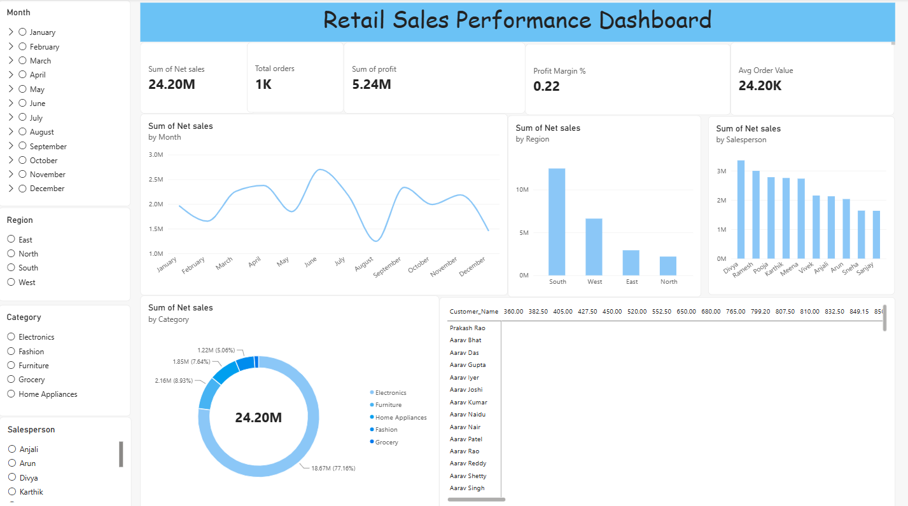

# 📊 Sales Dashboard — Data Analytics Project

## 📌 Project Overview

This project is an end-to-end **Sales Data Analytics and Dashboarding project** created to analyze sales performance, profitability, customer behavior, product performance, and regional trends.

The project uses **Excel, SQL, and Power BI** to clean, analyze, visualize, and present the data in an interactive dashboard.

The main objective is to transform raw sales data into meaningful business insights that can support data-driven decision-making.

---

## 🎯 Project Objectives

* Analyze overall sales performance
* Measure total sales, profit, orders, and units sold
* Analyze sales performance across different categories and regions
* Identify top-performing products
* Evaluate salesperson performance
* Analyze order status and delivery performance
* Understand customer segments
* Identify monthly sales trends
* Calculate and analyze profit margins
* Build an interactive Power BI dashboard
* Generate actionable business insights

---

## 🛠️ Tools & Technologies

* **Microsoft Excel** — Data cleaning, transformation, formulas, PivotTables and PivotCharts
* **SQL** — Data analysis and business queries
* **Microsoft Power BI** — Data visualization and interactive dashboard
* **DAX** — Measures and KPI calculations
* **GitHub** — Project documentation and portfolio

---

## 📂 Dataset

The dataset contains sales transaction information including:

* Order ID
* Order Date
* Customer ID
* Customer Name
* Gender
* Age
* City
* State
* Region
* Product ID
* Product Name
* Category
* Sub-Category
* Quantity
* Unit Price
* Discount
* Salesperson
* Payment Mode
* Order Status
* Delivery Date
* Rating
* Cost

---

## 🧹 Data Cleaning & Preparation

The raw sales data was cleaned and prepared before analysis.

The major data preparation tasks included:

* Removing unnecessary spaces from text fields
* Standardizing customer and city names
* Formatting dates
* Checking missing values
* Creating calculated sales and profit fields
* Creating delivery-day calculations
* Creating customer segments based on age
* Extracting useful information from Order IDs and Product IDs
* Preparing the dataset for PivotTable, SQL, and Power BI analysis

### Calculated Fields

**Gross Sales**

`Quantity × Unit Price`

**Discount Amount**

`Gross Sales × Discount`

**Net Sales**

`Gross Sales − Discount Amount`

**Total Cost**

`Quantity × Cost`

**Profit**

`Net Sales − Total Cost`

**Profit Margin**

`Profit ÷ Net Sales`

---

## 🗄️ SQL Analysis

SQL was used to perform business-oriented analysis on the sales dataset.

The analysis includes:

* Sales by category
* Sales by region
* Profit analysis
* Customer analysis
* Product performance
* Salesperson performance
* Order status analysis
* Aggregations using `SUM`, `COUNT`, and `AVG`
* Filtering using `WHERE`
* Grouping using `GROUP BY`
* Conditional analysis using `CASE`
* Sorting and ranking results

SQL queries used in this project are available in:

📁 `SQL/Sales_Analysis.sql`

---

## 📊 Power BI Dashboard

The cleaned data was imported into Power BI to create an interactive sales dashboard.

### Key Performance Indicators

The dashboard includes KPIs such as:

* **Total Sales**
* **Total Profit**
* **Total Orders**
* **Units Sold**
* **Profit Margin**
* **Average Rating**
* **Total Customers**

### Dashboard Visualizations

The dashboard contains visualizations for:

* Monthly Sales Trend
* Sales by Category
* Sales by Region
* Top 10 Products
* Salesperson Performance
* Order Status
* Profit by Category

### Interactive Filters

Users can interact with the dashboard using slicers such as:

* Date
* Region
* Category
* Sub-Category
* Order Status

---

## 📸 Dashboard Preview



---

## 💡 Key Business Insights

The dashboard can be used to identify:

* Overall sales and profitability trends
* High-performing product categories
* Top-performing products
* Regions contributing the most sales
* Salespersons generating higher revenue
* Changes in sales performance over time
* Order-status distribution
* Areas where profitability can be improved

These insights can help businesses make better decisions regarding products, sales strategies, regional performance, and customer management.

---

## 📁 Project Structure

```text
sales-dashboard/
│
├── README.md
│
├── Excel/
│   └── Sales_Data_Cleaned.xlsx
│
├── SQL/
│   └── Sales_Analysis.sql
│
├── PowerBI/
│   └── Sales_Dashboard.pbix
│
└── Screenshots/
    └── Sales_Dashboard.png
```

---

## 🚀 Key Skills Demonstrated

* Data Cleaning
* Data Transformation
* Exploratory Data Analysis
* Microsoft Excel
* PivotTables & PivotCharts
* SQL
* Data Aggregation
* Business Analysis
* DAX
* Power BI
* Data Visualization
* Dashboard Development
* KPI Development
* Business Insight Generation

---

## 👨‍💻 Project Purpose

This project was developed as part of my **Data Analytics portfolio** to demonstrate my ability to work with raw business data, perform analysis using Excel and SQL, and communicate insights through an interactive Power BI dashboard.
